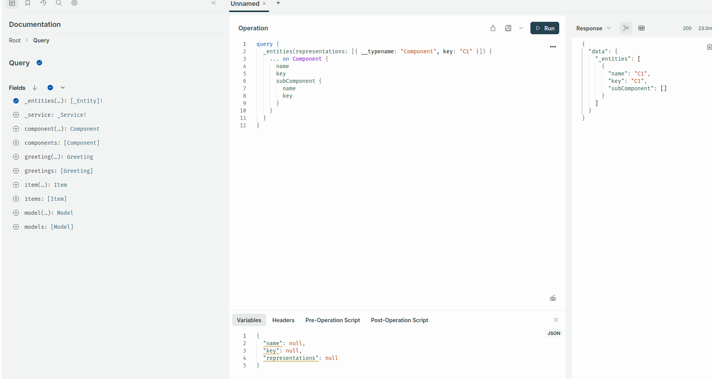

# xtext/EMF to graphql

This is a vibecoded sample project, which exposes a xtext/EMF model
to a graphql API.

## Layout

The sample grammar is in /one.wilmer.architecture/src/one/wilmer/architecture/ArchSpec.xtext
The sample server with hard coded input path can be started from /one.wilmer.architecture.server/one.wilmer.architecture.server.product
The server is located here /one.wilmer.architecture.graphql/src/one/wilmer/architecture/graphql/GraphQLServer.java

## Screenshot




## Sample File


```text
component C1 {
	
}
C1

Hello Test {
	value1 greet Test
}
```

